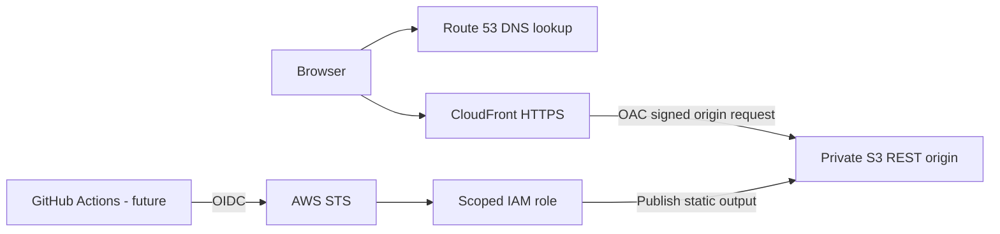

# Architecture overview

Status: local application implemented; AWS architecture proposed, no resources deployed.

Next.js builds HTML, CSS, JavaScript, and metadata into `out/`. Every public project/article route is generated at build time. There are no server actions, runtime APIs, database, credentials, tracking scripts, or remote fonts. App Router components default to server rendering at build time; navigation is the small client boundary for current-page state.

This matches the portfolio workload: inexpensive distribution, a small runtime attack surface, and a meaningful infrastructure/delivery learning project. See [ADR-001](../adr/ADR-001-static-hosting.md).

## Hosting requirements, not yet implemented

- Route 53 aliases point to CloudFront. Validate an ACM certificate in us-east-1 for CloudFront.
- Use a private S3 REST endpoint with Block Public Access and bucket-owner-enforced ownership. Grant only CloudFront service access scoped to the distribution ARN through OAC; require TLS. Do not enable website hosting.
- Redirect viewer HTTP to HTTPS. Choose a current supported TLS security policy at deployment.
- `trailingSlash: true` emits `/route/index.html`. A viewer-request CloudFront Function must canonicalize extensionless paths to trailing slashes and resolve directory requests to `index.html`. The default root object alone does not fix nested paths. Preserve asset/RSC requests and query strings; test both hard reloads and client navigation against the actual export.
- Map missing-origin objects (S3 can return 403 for missing keys) to the exported 404 page with HTTP 404, never an index-page 200 fallback.
- Cache hashed `_next/static` assets immutably; give HTML and route payloads short TTLs or invalidate after publishing. Upload assets before HTML, preserve prior assets across a retention window, and keep a release manifest for rollback.

## HTTP security headers

Implement a CloudFront response headers policy for HSTS after HTTPS verification, X-Content-Type-Options nosniff, Referrer-Policy strict-origin-when-cross-origin, and a Permissions-Policy disabling unused camera/microphone/geolocation features. Use CSP `frame-ancestors 'none'`, `object-src 'none'`, and `base-uri 'self'`.

CSP is a deployment gate: inspect the actual generated inline Next.js scripts, generate permitted hashes per release, and validate route navigation under a report-only policy before enforcement. A static export cannot issue a fresh request nonce. Do not copy an untested `script-src 'self'` policy that breaks hydration or weaken it silently with unsafe-inline. Keep headers within CloudFront limits; document the final design in an ADR.

## Identity and state

Future OIDC trust must check audience sts.amazonaws.com and an exact repository plus approved branch or protected GitHub environment subject. Separate infrastructure administration from object publishing; restrict object access to the target bucket and invalidation to the target distribution. No long-lived AWS keys in GitHub.

Bootstrap encrypted, versioned S3 state deliberately with native `use_lockfile` locking. Separate environment state and access. Commit provider lockfiles once providers are introduced; keep state, plans, and real variable values private.

## Operations and future backend

Before launch define budget alerts, CloudFront error/traffic alarms, logging with minimal retention and privacy controls, release rollback, DNS recovery, and ownership. Review static output for sensitive data before publishing.

Only when needed, a contact endpoint may use API Gateway → Lambda → SES. Validate payload size/schema, rate-limit abuse, restrict CORS, prevent mail header injection, and define retention before collecting data. Add DynamoDB only with a documented persistence requirement.

References: [Next.js static export](https://nextjs.org/docs/app/guides/static-exports), [CloudFront OAC](https://docs.aws.amazon.com/AmazonCloudFront/latest/DeveloperGuide/private-content-restricting-access-to-s3.html), [Terraform S3 backend](https://developer.hashicorp.com/terraform/language/backend/s3).
